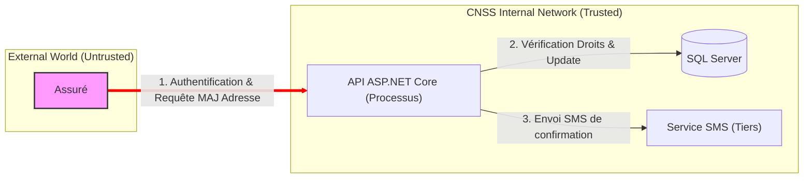

# Lab 2 : Modélisation des menaces et Protection BOLA

Ce lab se concentre sur l'étape de **Conception Sécurisée**. Avant d'écrire du code, nous devons comprendre les menaces qui pèsent sur notre système.

---

## Exercice 1 : Diagramme de Flux de Données (DFD)

Le diagramme ci-dessous représente le flux d'informations pour l'API "Dossier Assuré". La ligne rouge représente la **Frontière de Confiance** (Trust Boundary).

---

## Exercice 2 : Analyse STRIDE

Analyse des menaces pour le flux **"Mise à jour adresse"** traversant la frontière de confiance :

| Menace | Type | Question de sécurité |
| :--- | :--- | :--- |
| **S**poofing | Identité | Un attaquant peut-il se faire passer pour un assuré légitime ? |
| **T**ampering | Intégrité | L'adresse peut-elle être modifiée pendant le transit entre le client et l'API ? |
| **R**epudiation | Non-répudiation | Un assuré peut-il nier avoir effectué une mise à jour d'adresse ? |
| **I**nformation Disclosure | Confidentialité | Un tiers peut-il lire l'adresse de l'assuré en écoutant le réseau ? |
| **D**enial of Service | Disponibilité | Peut-on saturer l'API pour empêcher les assurés d'accéder à leurs dossiers ? |
| **E**levation of Privilege | Autorisation | Un assuré peut-il modifier l'adresse d'un autre assuré (**BOLA**) ? |

---

## Exercice 3 : Matrice des Risques

| ID | Menace (STRIDE) | Impact (1-5) | Proba (1-5) | Score | Mesure d'atténuation (Contrôle) |
| :--- | :--- | :---: | :---: | :---: | :--- |
| R1 | **BOLA** : Accès au dossier d'autrui | 5 | 3 | **15** | Valider l'`OwnerId` en base de données par rapport au `Subject` du JWT. |
| R2 | **DoS** : Inondation de requêtes | 3 | 4 | **12** | Mettre en place un middleware de Rate-Limiting. |
| R3 | **SQL Injection** : Vol de données | 5 | 2 | **10** | Utiliser Entity Framework Core ou des requêtes paramétrées. |
| R4 | **Sensitive Data Exposure** : Log de SMS | 3 | 2 | **6** | Masquer les numéros de téléphone et codes dans les logs JSON. |

---

## Exercice 4 : Mise en pratique (Prévention BOLA)

### Contexte
Le **BOLA (Broken Object Level Authorization)** est la vulnérabilité #1 du OWASP API Security Top 10. Elle survient quand l'application se base uniquement sur l'ID fourni dans l'URL sans vérifier si l'utilisateur connecté a le droit d'accéder à cet objet spécifique.

### Votre mission
Dans le projet `lab-2/Cnss.SecureApi`, modifiez le fichier `Program.cs` pour :
1. Ajouter un endpoint `GET /dossier/{id}`.
2. Simuler un utilisateur connecté via un header HTTP `X-User-Id`.
3. Vérifier que l'ID demandé correspond à l'ID du header.

### Validation
Testez avec `curl` :
- **Succès (Légitime)** : `curl -H "X-User-Id: 100" http://localhost:5001/dossier/100` (Doit retourner 200 OK)
- **Échec (Attaque BOLA)** : `curl -H "X-User-Id: 999" http://localhost:5001/dossier/100` (Doit retourner 403 ou 404)
